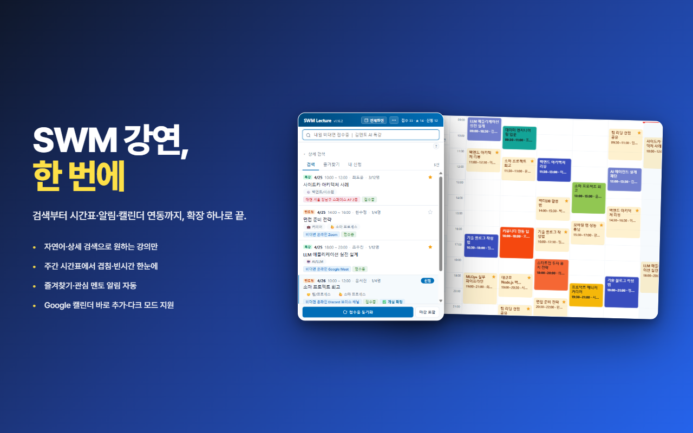
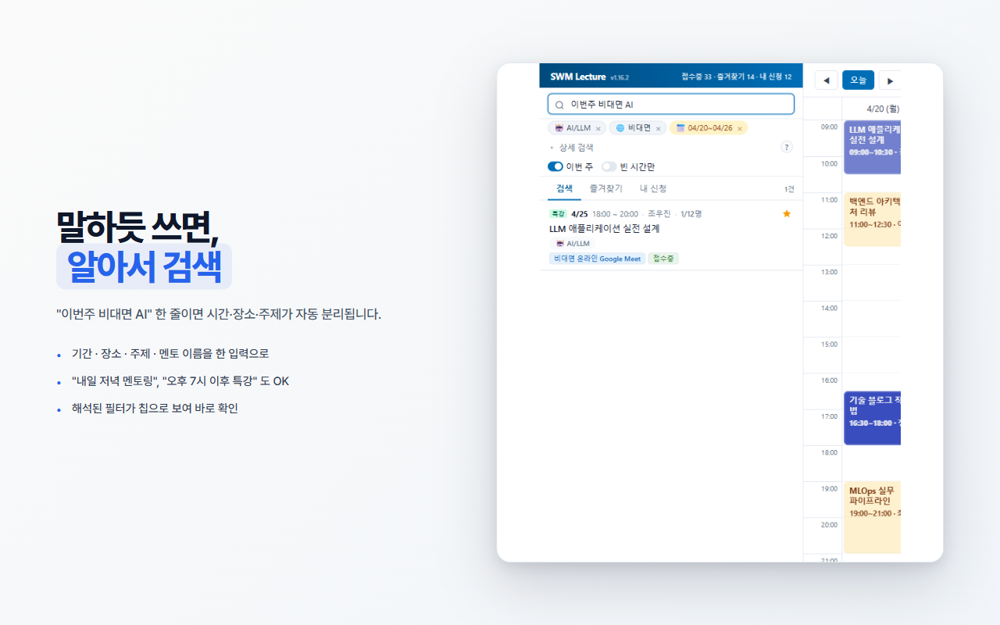
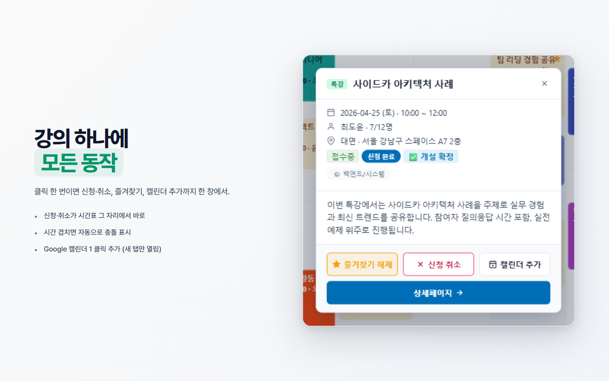
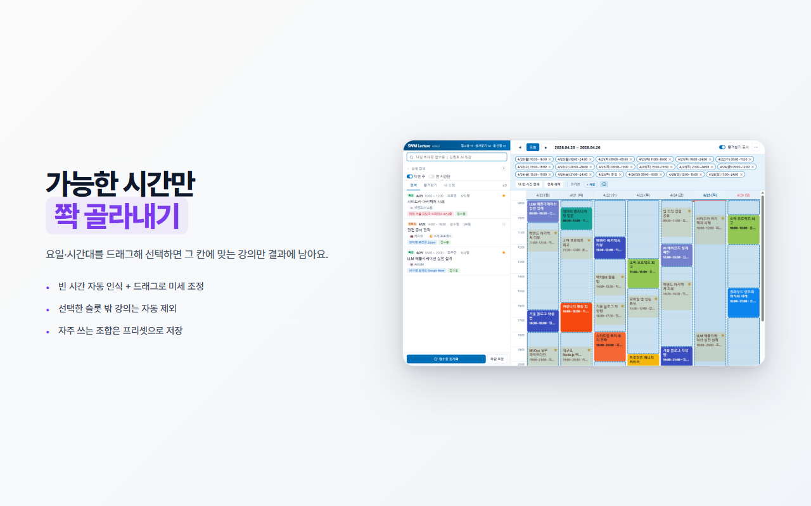
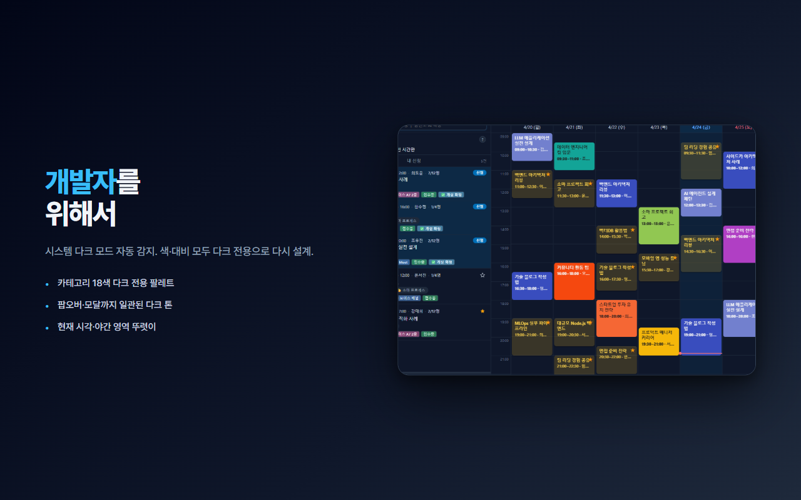

<div align="center">

# SWM Lecture Helper

**SW마에스트로 멘토링·특강을 더 빠르게.**

검색부터 시간표·알림·캘린더 연동까지, 확장 하나로 끝.

[](https://chromewebstore.google.com/detail/swm-lecture-helper/oohcbjjaklphbmoeiecddpdfkbadpaan)
[](./manifest.json)
[](#라이선스)

[**스토어에서 설치 →**](https://chromewebstore.google.com/detail/swm-lecture-helper/oohcbjjaklphbmoeiecddpdfkbadpaan)

</div>

<p align="center">
  
</p>

---

## 어떤 확장인가요?

SW마에스트로 멘토링·특강을 매번 사이트 들어가서 일일이 찾기 번거로웠다면, 이 확장이 도와줍니다.

브라우저 한쪽에서 강의를 검색하고, 주간 시간표로 한눈에 보고, 클릭 한 번으로 신청·캘린더 추가까지 끝낼 수 있어요.

---

## 이렇게 써요

### 1. 말하듯 써도 알아서 검색

`이번주 비대면 AI` 한 줄이면 시간·장소·주제가 자동으로 분리됩니다. 해석된 필터가 칩으로 보여서 의도와 맞는지 바로 확인할 수 있어요.

<p align="center">
  
</p>

### 2. 강의 하나에 모든 동작

블록을 누르면 한 창에서 신청·취소·즐겨찾기·캘린더 추가까지 처리됩니다. 시간이 겹치면 자동으로 충돌 표시도 해요.

<p align="center">
  
</p>

### 3. 가능한 시간만 콕 짚어 검색

"평일 저녁만 가능한데, 그 시간에 들을 수 있는 강의가 뭐 있지?"

요일·시간대를 드래그로 선택하면 그 칸에 맞는 강의만 결과에 남습니다. 자주 쓰는 조합은 프리셋으로 저장해 두고 한 번에 불러올 수도 있어요.

<p align="center">
  
</p>

### 4. 밤에 봐도 편안하게

시스템 다크 모드를 자동 감지합니다. 카테고리 색·배지·대비를 다크 전용으로 새로 설계했어요.

<p align="center">
  
</p>

---

## 시작하기

1. [Chrome Web Store 에서 설치](https://chromewebstore.google.com/detail/swm-lecture-helper/oohcbjjaklphbmoeiecddpdfkbadpaan)
2. [swmaestro.ai 멘토링 페이지](https://www.swmaestro.ai/sw/mypage/mentoLec/list.do?menuNo=200046) 에 로그인
3. 확장 아이콘을 누르고 **동기화** 한 번 — 그 다음부터는 30분 주기로 자동 업데이트

---

## 더 자세한 기능

<details>
<summary><b>알림 설정</b></summary>

기본은 모두 꺼져 있습니다. ⋯ 메뉴에서 원하는 것만 켜세요.

- 🔔 **신규 강연** — 새 강연이 등장하면 데스크톱 알림
- ⭐ **즐겨찾기 빈자리** — 만석이었다가 자리 생기면
- 👤 **관심 멘토 매치** — 직접 등록한 멘토의 새 강연이 뜨면

</details>

<details>
<summary><b>시간표 단축키</b></summary>

| 키 | 동작 |
|---|---|
| `←` `→` | 이전/다음 주 |
| `T` | 오늘 주로 이동 |
| `/` | 검색창에 포커스 |
| `Esc` | 팝오버 닫기 |

</details>

<details>
<summary><b>⋯ 메뉴 (시간표 우상단)</b></summary>

- 📅 캘린더 추가 (신청 전체) — Google 캘린더에 한 번에 등록
- 📥 iCal 내보내기 — `.ics` 파일 (Apple Calendar·Outlook 호환)
- 🖨 인쇄 / PDF
- 🌓 다크 모드 / 🎨 시간표 블록 색 테마 (4종)
- 🗑 데이터 초기화

</details>

<details>
<summary><b>드래그 시간대 선택 디테일</b></summary>

- 10분 단위 그리드, 부드러운 스냅
- 요일 헤더 클릭 → 그 요일 종일 토글
- 우클릭 → 슬롯 개별 제거
- "내 빈 시간 전체" 버튼 → 신청 강연 사이 빈 시간을 자동으로 채움
- 매칭 규칙: 강의 시간이 선택 슬롯 안에 **완전히** 들어와야

</details>

---

## 개인정보·보안

- 모든 데이터는 **내 브라우저 안에만** 저장됩니다 (`chrome.storage.local`)
- 외부 서버 전송 없음 · 분석 없음 · 광고 없음
- 신청·취소를 누를 때마다 확인 다이얼로그가 뜨고, 명시적으로 승인한 다음에만 swmaestro.ai 에 요청을 보냅니다 (사이트에서 직접 누르는 것과 동일)
- 확장을 제거하거나 ⋯ 메뉴 → "데이터 초기화" 로 언제든 깔끔하게 정리할 수 있습니다

자세한 내용: [PRIVACY.md](./PRIVACY.md)

---

## 개발자 모드로 직접 로드

```bash
git clone https://github.com/colswap/swm-lecture-helper.git
```

`chrome://extensions` → 우측 상단 **개발자 모드** ON → **"압축해제된 확장 프로그램을 로드합니다"** → 클론한 폴더 선택.

테스트 실행:

```bash
node --test test/
```

---

## 변경 이력

각 버전의 변경 사항은 [CHANGELOG.md](./CHANGELOG.md) 에 정리되어 있습니다.

---

## 기여 / 라이선스

- 버그 리포트·제안: [Issues](https://github.com/colswap/swm-lecture-helper/issues)
- MIT © colswap

본 확장은 **SW마에스트로 공식 도구가 아닙니다.** 개인 보조용 비영리 도구이며, 사이트 이용약관 범위 안에서만 동작합니다.
