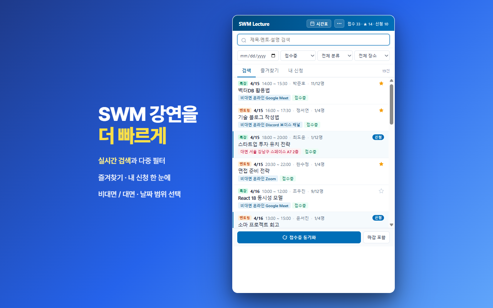
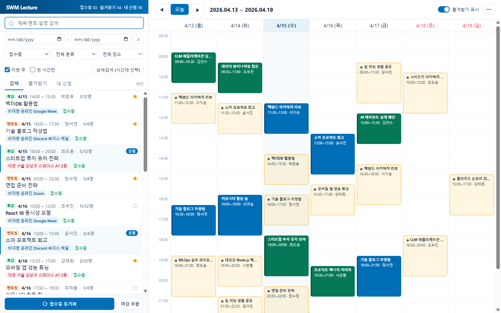
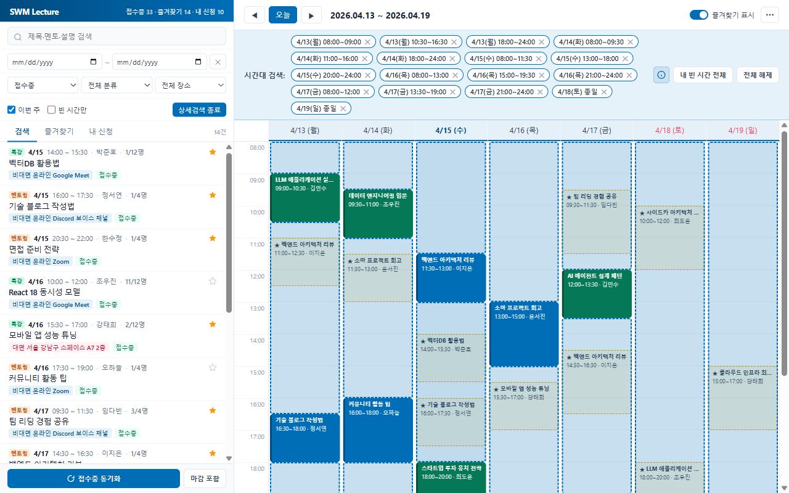
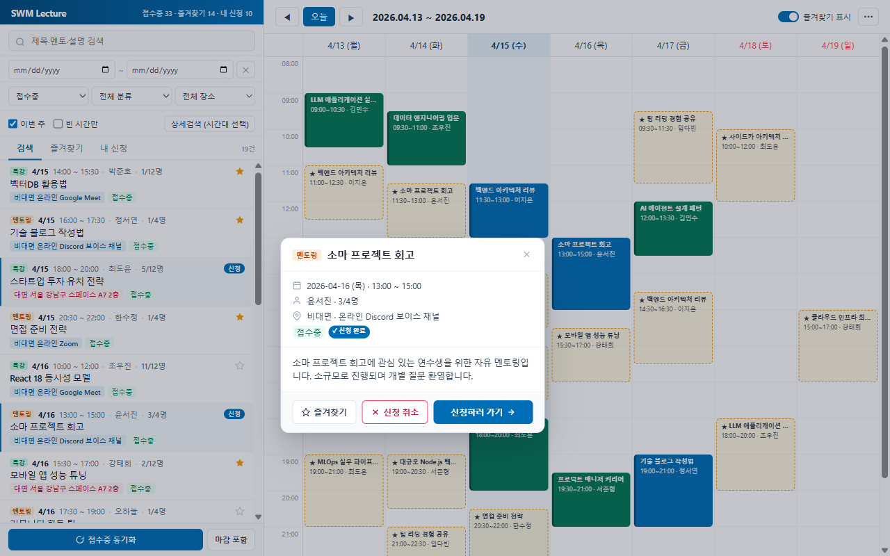
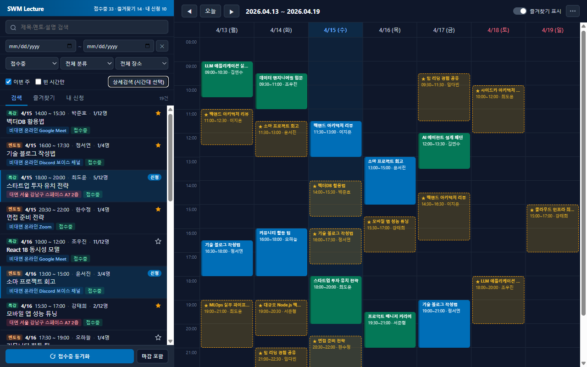

<div align="center">

# SWM Lecture Helper

**SW마에스트로 강연을 더 빠르게.**

<sub>팝오버에서 바로 신청·취소 · 풀탭 주간 시간표 · 빈 시간 기반 검색 · 다크 모드</sub>

[](https://chromewebstore.google.com/detail/swm-lecture-helper/oohcbjjaklphbmoeiecddpdfkbadpaan)
[](./manifest.json)
[](#라이선스)

[**스토어에서 설치 →**](https://chromewebstore.google.com/detail/swm-lecture-helper/oohcbjjaklphbmoeiecddpdfkbadpaan)

</div>

<p align="center">
  
</p>

---

## 왜 쓰나

SW마에스트로(swmaestro.ai) 멘토링/특강 게시판은 **목록 뷰만** 있어 주간 일정 한눈에 보기 어렵고, 신청하려면 페이지 왕복이 필요합니다.

이 확장은:
- 700+ 강연을 **로컬 캐시** 해 즉시 검색
- **풀탭 주간 시간표** 로 신청 현황 + 즐겨찾기 한 화면에
- **팝오버 안에서 바로 신청/취소** — 사이트 왕복 없음
- **빈 시간대 기반 검색** — 드래그로 시간 선택하면 그 시간 가능한 강연만 필터

## 스크린샷

### 검색 + 필터 + 내 신청 탭


### 빈 시간대 선택 → 매칭 강연 필터


### 팝오버에서 즉시 신청·취소


### 다크 모드


## 기능

### 팝업 (빠른 조회)
- **키워드 검색** — 제목·멘토명·설명·장소
- **다중 필터** — 날짜 범위(A~B), 접수 상태, 분류(멘토 특강/자유 멘토링), 장소(비대면/대면)
- **3개 탭** — 검색 / 즐겨찾기 / 내 신청
- **★ 즐겨찾기** — 관심 강연 모아보기
- **이미 시작한 강연 자동 제외** (접수중 탭)

### 풀탭 시간표
팝업 헤더의 **"시간표"** 버튼으로 열기.

- **주간 캘린더** — 월 - 일 × 08:00 - 24:00, 10분 단위 그리드
- **신청 강연 블록** + **즐겨찾기 반투명 오버레이** (토글)
- **팝오버** — 블록 클릭 시 카테고리·시간·장소·멘토·설명·인원
  - ⚡ **즉시 신청** — 팝오버에서 바로 (사이트 왕복 불필요)
  - 🚫 **신청 취소** — 마찬가지로 바로
  - 상세페이지 — swmaestro.ai 상세 페이지 새 탭 열기
- **드래그 시간대 선택** (10분 스냅):
  - 요일 헤더 클릭 → 그 요일 종일 토글
  - 우클릭 → 슬롯 개별 제거
  - **"내 빈 시간 전체"** — 신청 강연 제외하고 빈 슬롯 자동 선택
  - 매칭: 강연 시간이 선택 슬롯에 *완전 포함* 되어야
- **날짜 범위 (A~B)** 필터, "이번 주" 빠른 토글
- **호버 프리뷰** — 검색 결과 hover 시 반투명 후보 블록 + 충돌 경고

### ⋯ 메뉴 (시간표 우상단)
- 📅 **iCal 내보내기** — 신청 강연을 `.ics` 로 (Asia/Seoul 시간대)
- 🖨 **인쇄 · PDF** — 시간표만 깔끔하게
- 🌓 **테마** — 시스템 / 라이트 / 다크 순환
- 🗑 **데이터 초기화**

### 백그라운드 · 알림
- **자동 동기화** — 30분 주기 (Chrome + swmaestro.ai 탭 열린 상태)
- **알림 설정** (⋯ 메뉴 → "알림 설정") — 기본 모두 OFF, 원하는 것만 켜기
  - 🔔 **신규 강연** — 새 강연 등장 시 데스크톱 알림
  - ⭐ **즐겨찾기 빈자리** — 만석 → 빈자리 생기면
  - 👤 **관심 멘토 매치** — 관심 멘토 이름 직접 등록, 그 멘토 새 강연 등장 시

## 설치

### Chrome Web Store (권장)
[**Chrome Web Store 에서 설치 →**](https://chromewebstore.google.com/detail/swm-lecture-helper/oohcbjjaklphbmoeiecddpdfkbadpaan)

### 개발자 모드 (직접 로드)

```bash
git clone https://github.com/colswap/swm-lecture-helper.git
```

1. Chrome → `chrome://extensions`
2. 우측 상단 **개발자 모드** ON
3. **"압축해제된 확장 프로그램을 로드합니다"** → `swm-lecture-helper` 폴더 선택

## 사용 흐름

1. [swmaestro.ai 멘토링 페이지](https://www.swmaestro.ai/sw/mypage/mentoLec/list.do?menuNo=200046) 로그인
2. 확장 아이콘 → **"접수중 동기화"** (최초 1회, 이후 30분 자동)
3. 팝업에서 검색·필터·★ 즐겨찾기로 탐색
4. **"시간표"** 버튼 → 풀탭 열기 → 팝오버에서 즉시 신청·취소

## 키보드 단축키 (시간표)

| 키 | 동작 |
|---|---|
| `←` / `→` | 이전/다음 주 |
| `T` | 오늘 |
| `/` | 검색창 포커스 |
| `Esc` | 팝오버 닫기 |

## 개인정보 · 보안

- 모든 데이터는 `chrome.storage.local` 에만 저장, 외부 서버 전송 없음
- 강연 목록/상세는 **로그인된 본인 계정 범위 내**에서만 수집
- **"즉시 신청 / 취소"** 는 `confirm()` 다이얼로그로 명시적 승인 후에만 swmaestro.ai API 호출 (사이트에서 직접 클릭하는 것과 동일)
- 확장 제거 또는 "데이터 초기화" 로 언제든 삭제

상세: [PRIVACY.md](./PRIVACY.md)

## 기술 스택

- Chrome Extension Manifest V3
- Vanilla JS (프레임워크/번들러 없음)
- Chrome API: `storage.local`, `alarms`, `notifications`, `tabs`
- 로컬 저장만, 외부 라이브러리 없음

## 버전 히스토리

| 버전 | 주요 변경 |
|---|---|
| **1.11.0** | 팝오버 즉시 신청/취소 |
| **1.10.x** | 다크 모드, 팝업 ⋯ 메뉴, hasStarted 필터, 색 분리 |
| **1.9.x** | "내 빈 시간 전체", 우클릭 슬롯 제거, 인포 블록 |
| **1.8.x** | 10분 스냅, 완전 포함 매칭, 취소 강연 반영 |
| **1.3.0~1.7.x** | 풀탭 시간표, iCal, 인쇄, 드래그 시간대 선택 |
| **1.0.x~1.2.x** | 최초 출시, 팝업 검색/필터, 즐겨찾기 |

## 기여

버그 리포트·제안: [Issues](https://github.com/colswap/swm-lecture-helper/issues)

## 라이선스

MIT © colswap

## 고지

본 확장은 **SW마에스트로 공식 도구가 아니며**, 개인 보조용 비영리 도구입니다. 사이트 이용약관 범위 내에서만 동작합니다.
